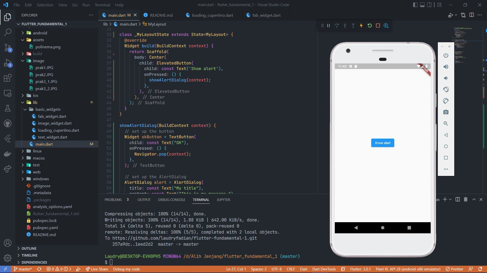
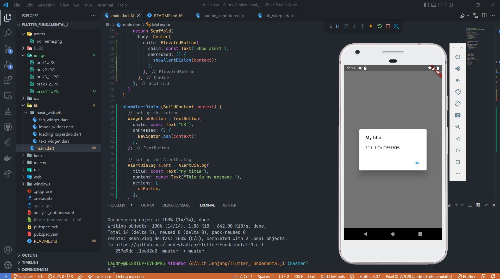
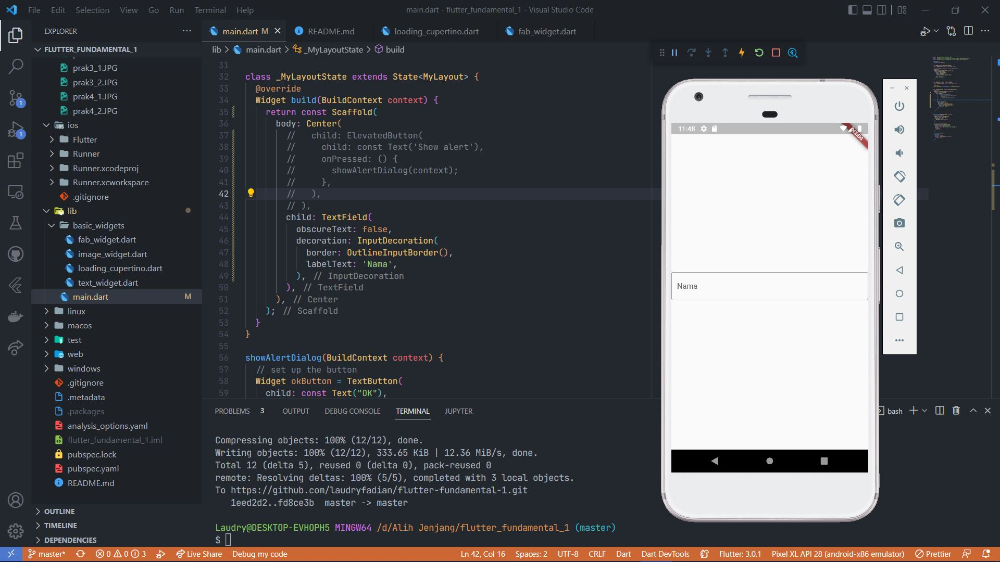
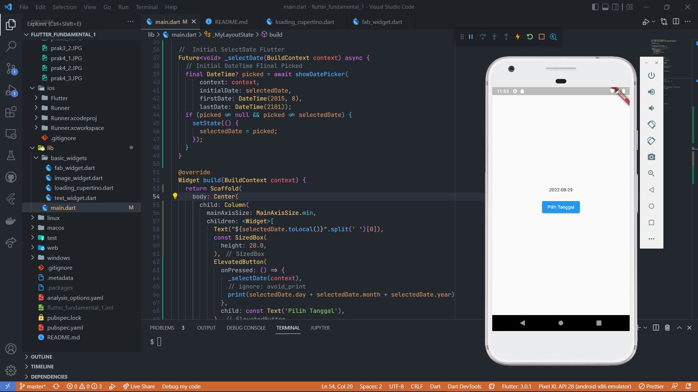
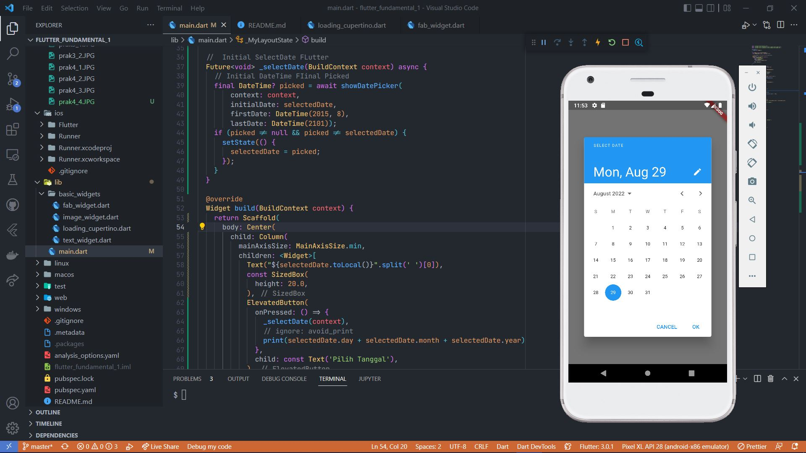

# Flutter Fundamental Part 1
### Praktikum 1

Create new project flutter

### Praktikum 2

Create Repo Github

### Praktikum 3

Text Widget

Image Widget

### Praktikum 4

Dialog

Text Input

Datepicker

